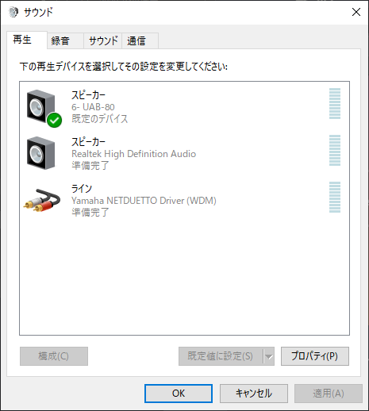
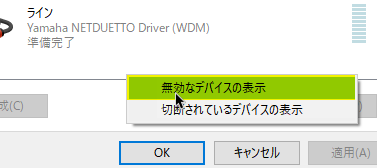
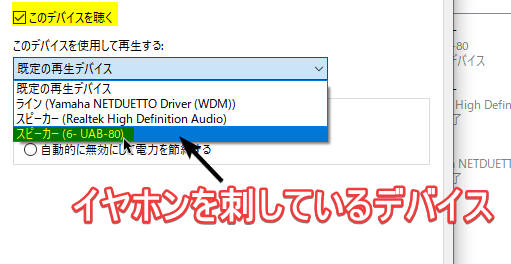
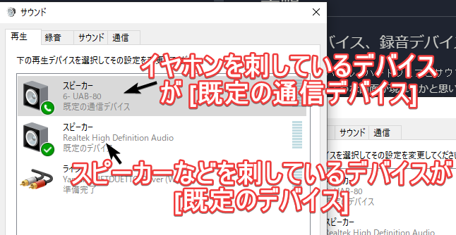
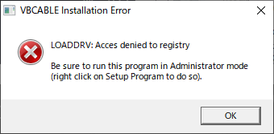
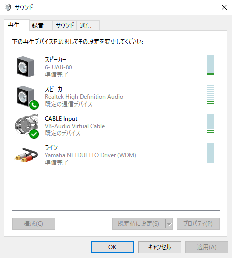
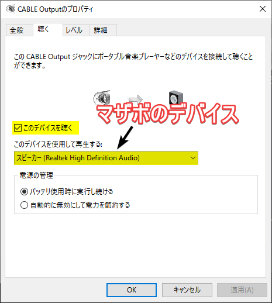
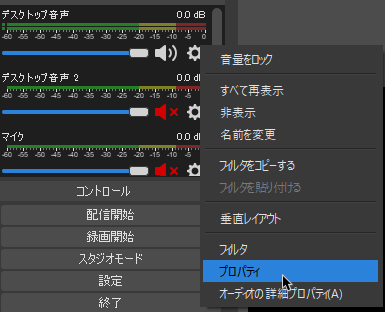
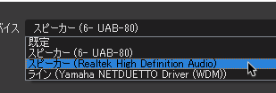
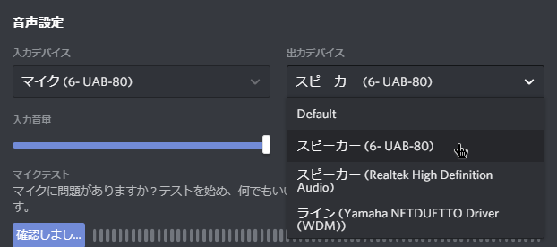

いや、お前らも消したくないか？  
教えます。
<!--more-->
**不備があったらコメント欄やTwitterで教えてください！できる限りで修正します。**
**このページではオーディオインターフェースを使わないため、ごちゃごちゃしています。**
**素直に使ったほうが身の為ですが、こっちの方が安上がりです。**
# 必要なもの
* __ステレオミキサーが使える__オーディオの...アレ。出力するやつ。  
朕は `Realtek High Definition Audio` というものでした。大体みんなそうだよな？

また、この手法では**イヤホンとスピーカーから同時に音が出るようになる**ため、うるさい場合は**常にスピーカーの音量を0にする**ことをおすすめします。
# 手順
## 1. 再生デバイス、録音デバイス の設定をする。

### 物理的なデバイスを使う場合
**必要なものが増えます！**  
* オンボードのサウンドデバイス以外に、もう1つUSBなどで繋がるオーディオデバイス (これ結構環境絞られるだろ)  
例えば、マイクに付属しているものでもいいです。
* PC 本体に繋げるための捨てスピーカー  
もちろん捨て、でなくても普通に使用するのであれば大丈夫です。

`コントロール パネル`、`ハードウェアとサウンド`、`サウンド デバイスの管理` と進みます。  
すると、下図のような画面が現れるかと思います。  
  
まず、`録音` タブを開き、`ステレオ ミキサー`のプロパティを開きます。  
表示されない場合は、何もないところを右クリックし、`無効なデバイスを表示`をクリックしてください。  
  
プロパティが開けたら、下図のように指定し、`OK` をクリックします。

↑では「イヤホンを刺しているデバイス」と表記していますが、厳密に言うと**マザーボードのサウンドデバイスではない方**です。

次に `再生` タブを開き、下図のようになる様、設定してください。  

### 仮想のデバイスを使う場合
この手段は、**音声にラグが発生する場合があります。**
まず、VB-Cable というソフトウェアを [VB-Audio Virtual Apps: https://www.vb-audio.com/Cable/index.htm](https://www.vb-audio.com/Cable/index.htm) からダウンロードし、インストールします。  
ダウンロードした zip ファイルを解凍し、
* 32ビット版 (x86) Windows を実行している場合は `VBCABLE_Setup.exe`  
* 64bit版 (x64) Windows を実行している場合は `VBCABLE_Setup_x64.exe`  

を開き、インストールを進めます。  
また、以下のダイヤログが表示された場合は、exe ファイルを右クリックし `管理者として実行` から開きます。
  
**ここで、一旦整理します。**  
今回、物理デバイスを使う場合と異なるのは以下の点です。  
* 前者の手順でのマザーボードのサウンドデバイスは、**通話 + デスクトップ音声** が流れます。
* 前者の手順での外付けUSB等のサウンドデバイスは、**デスクトップ音声**のみが流れます。

作業を再開します。  
`コントロール パネル`、`ハードウェアとサウンド`、`サウンド デバイスの管理` と進みます。  
すると、下図のような画面が現れるかと思います。  
  
`既定のデバイス`、`既定の通信デバイス` を上記のように設定してください。  
次に、`録音`タブを開きます。
`CABLE Output` のプロパティを開き、`聴く` タブを開いた後、下図のように設定します。

## 2. OBSの設定
最初に言った通り、私達は**OBSに通話の音を入れたくありません！！！！！！**  
ですから、その為の設定が必要です。

OBSを開き、デスクトップ音声のところの歯車をクリックし、プロパティを開きます。  
  
それから、マザーボードに付属しているサウンドデバイスを選択します。

* 物理的なデバイスを使う手順を踏んでいる場合:  
**マザーボードのサウンドデバイスを指定する**  
自分の場合は `スピーカー (Realtek High Definition Audio)` でした。  
* 仮想のデバイスを使う手順を踏んでいる場合:  
**VB-Cableのサウンドデバイスを指定する**  
ここは全員共通で `CABLE Input (VB-Audio Virtual Cable)` だと思います。  

## 3. 【一応】 通話アプリの設定をする。
今回ぼくは`Discord`というアプリを使って通話をしたいので、その設定を一応しておきます。  
まあ、再生デバイスを

* 物理的なデバイスを使う手順を踏んでいる場合:  
マザーボードのサウンドデバイス**ではない**方に指定する 
* 仮想のデバイスを使う手順を踏んでいる場合:  
マザーボードのサウンドデバイスの方に指定する 

だけですね。
これでできるようになると思います。補足が必要であれば遠慮なく言ってください。  
正直、半分深夜テンションで書いたので不備ありまくりだと思います。  
それでは。
