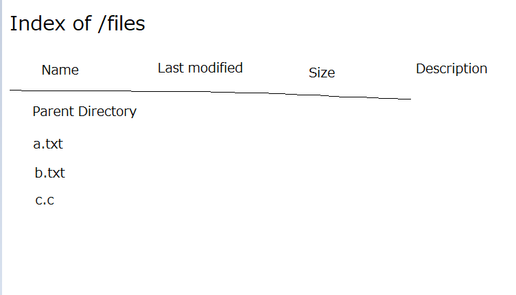
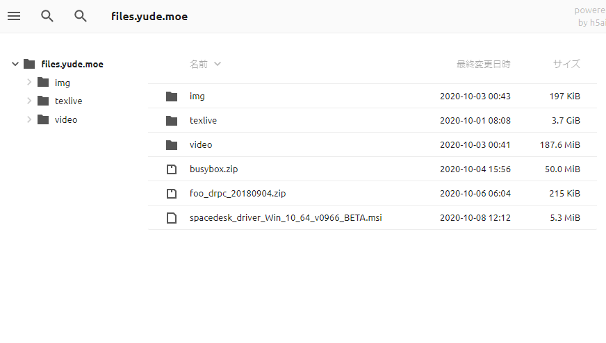
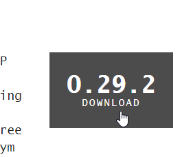
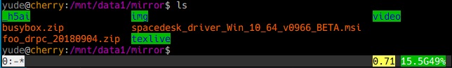

# 機能
nginx のインデックスページ、こんな感じだと思うんですけど  
  
これが、このように盛れます  
  
以下方法  
<!--more-->
# 導入
## h5ai をダウンロード  
 から最新バージョンの h5ai が含まれた zip ファイルをダウンロードして、サーバーに設置してください。  

## nginx の設定をする  
下記の内容を、適宜変更して使用してください。

  upstream php-fpm {
    server unix:/run/php/php-fpm.sock;
  }
  
  server{
    listen 80;
    server_name your.domain;
    root /path/to/root/of/your/files;
    index  /_h5ai/public/index.php;
    location ~ \.(php)$ {
      include fastcgi_params;
      fastcgi_index index.php;
      fastcgi_param   SCRIPT_FILENAME         $document_root$fastcgi_script_name;
      fastcgi_pass php-fpm;
    }
  }

上の root に指定するパスには、公開したいファイル群と、`_h5ai` ディレクトリが設置されている必要があります。  
具体的には `files.yude.moe` の環境において、`ls` コマンドを実行したとき、以下のように表示されます。  
  
参考にしてください。

以上の設定を行った後、アクセスができるようになるはずです。