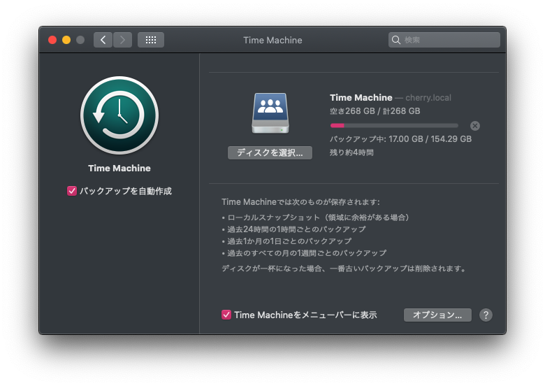

netatalk を使用して、Ubuntu 上に Time Machine のバックアップ先サーバーを作成します。

<!--more-->
# 検証環境
* サーバー: Ubuntu Server 20.04.2 LTS
* クライアント: macOS Catalina 10.15.7

# 手順
## 1. サーバー側: ファイアウォールの設定
以下のポート・サービスを許可する必要があります。ファイアウォールを使用していない場合はこの設定を行う必要はありまん。  
* サービス: Samba
* ポート: 548  

ufw を使っている場合は、以下のコマンドで設定を追加できます。
```
sudo ufw allow samba
sudo ufw allow 548
```

## 2. サーバー側: 必要なパッケージのインストール
以下のパッケージがサーバー側に必要です。
* netatalk  

Ubuntu では、以下のコマンドでインストールします。
```
sudo apt install netatalk
```

## 3. サーバー側: バックアップ先ディレクトリを設定
`mkdir` コマンドを使用して、バックアップに使用するディレクトリを作成します。  
また、以下のコマンドで適切な権限に設定し、macOS がアクセスできるようにします。
```
sudo chmod -R 2755 (バックアップに使用するディレクトリへのパス)
```

## 4. サーバー側: netatalk の設定
`/etc/netatalk/afp.conf` に以下の内容を追記します。  
```
[Time Machine]
path = (バックアップに使用するディレクトリへのパス)
time machine = yes
vol size limit = 256000
```
上の例では、`vol size limit` により Time Machine が使用できる容量を 256GB に制限しています。  
この記述が存在しない場合、Time Machine はディレクトリが存在するパーティションの限界までバックアップに使用します。  
あなたの Mac のストレージ容量や、バックアップ先ストレージの容量によって、適宜編集してください。
行った設定を反映するには、以下のコマンドを実行します。
```
sudo systemctl restart netatalk
```

## 5. クライアント側: Time Machine の設定
macOS 側で Time Machine の設定を開くと、netatalk によって提供されているバックアップ先の項目が現れているはずです。  
AirMac 等にバックアップする場合と同様に操作を行います。

